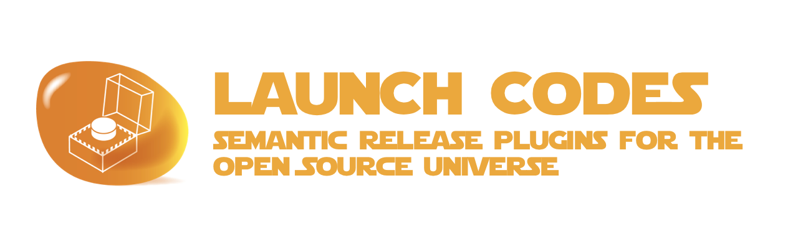

# launchcodes



> **THIS PROJECT IS STILL IN THE DESIGN PHASE**
>
> IDEAS & CONTRIBUTIONS ARE WELCOME
>
> An [Open Source Universe](https://github.com/intellibus/approach) Project

---

## Contents

- [launchcodes](#launchcodes)
  - [Contents](#contents)
  - [Features ✨](#features-)
  - [Install 🛠](#install-)
  - [Usage 🔭](#usage-)
  - [Documentation 🛰](#documentation-)
  - [Contributing 🌎](#contributing-)
  - [License ⚖️](#license-️)

## Features ✨

- Google Add-Ons Store Plugin `Planned`
- Chrome Extension Store Plugin `Planned`
- Firefox Extension Store Plugin `Planned`
- Solar System Plugin `Planned`

## Install 🛠

```sh
npm install launchcodes
```

## Usage 🔭

Read more about the [Design](https://github.com/intellibus/launchcodes/blob/main/DESIGN.md) behind `launchcodes` here.

`.releasesrc.json`

```json
{
  "plugins": [
    [
      "launchcodes",
      {
        "projectType": "google-add-ons"
      }
    ]
  ]
}
```

## Documentation 🛰

`launchcodes` *is under active development, documentation will be added once an initial release is ready.*

## Contributing 🌎

We would love for you to contribute your ideas, code, & fixes to `launchcodes`.

We encourage everyone to read our [Design Document](https://github.com/intellibus/launchcodes/blob/main/DESIGN.md) to learn more about the thought process behind launchcodes.

Also check out the [rewards](https://github.com/intellibus/approach/blob/main/REWARDS.md) offered for contributing to the [Open Source Universe](https://github.com/intellibus/approach).

## License ⚖️

MIT
